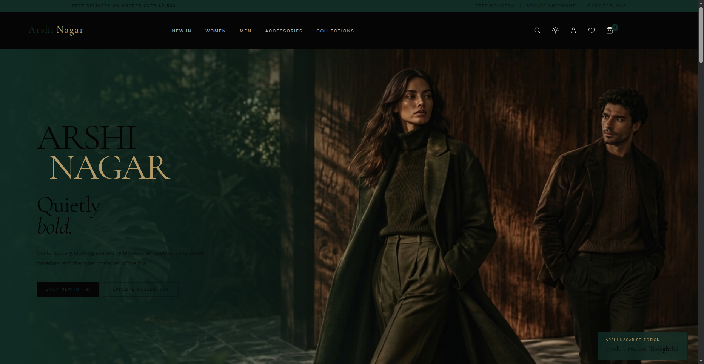

# Arshi Nagar — Fashion E-Commerce Website

A modern fashion e-commerce storefront combining classical aesthetics with contemporary web design.

Arshi Nagar is designed as a polished, editorial-style fashion shopping experience with curated collections, product browsing, responsive layouts, and a refined visual identity.

## Live Preview

**[Visit Arshi Nagar →](https://arshinagar-fashion.vercel.app/)**



---

## Overview

Arshi Nagar is a fashion-focused e-commerce website concept built with an emphasis on:

- Editorial visual design
- Bengali-inspired aesthetics
- Modern product presentation
- Smooth interactions and animations
- Responsive layouts
- Clean and maintainable component structure
- A premium fashion-store experience

The interface combines deep forest tones, warm walnut accents, ivory surfaces, and elegant typography to create a distinctive visual identity.

---

## Features

### > E-Commerce Experience

- Product browsing
- Product categories
- Product cards
- Product quantity controls
- Shopping bag / cart
- Wishlist interactions
- Subtotal calculation
- Toast notifications
- Search overlay
- Responsive mobile navigation

### > Visual Design

- Editorial fashion-inspired layout
- Bengali-inspired visual direction
- Forest green, walnut, ivory and gold palette
- Elegant serif typography
- Subtle grain texture
- Image-focused product presentation
- Reveal-on-scroll animations
- Hover interactions
- Smooth transitions

### > Responsive

Designed to provide a consistent experience across:

- Desktop
- Tablet
- Mobile

---

## > Tech Stack

- **React**
- **TypeScript**
- **Vite**
- **Tailwind CSS**
- **JavaScript / TypeScript**
- **Responsive CSS**
- **Vercel**

---

## > Project Structure

```text
arshi_nagar/
├── public/
├── src/
│   ├── assets/
│   │   ├── preview.png
│   │   ├── hero images
│   │   ├── category images
│   │   └── product images
│   ├── components/
│   ├── pages/
│   └── ...
├── package.json
├── vite.config.ts
└── README.md
